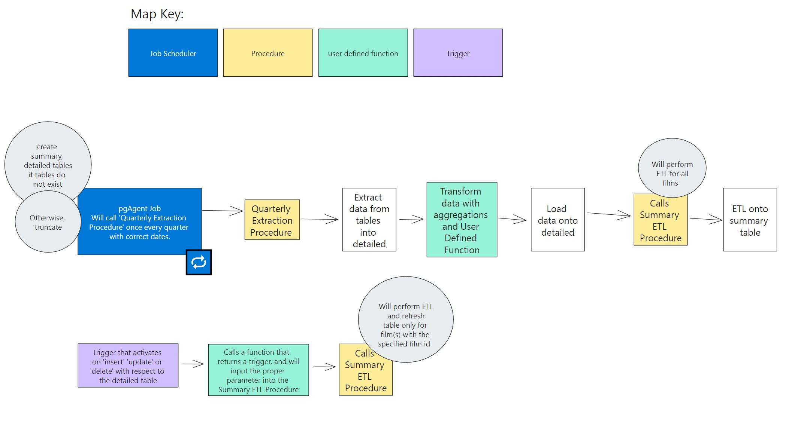

# What this repo is about
This repo was for an assignment I had in my Advanced Data Management class at WGU. 
The goal was to create a series of tables for the dvdrental data set: One called summary and one called detailed. 
The detailed table contains a collection of granular datapoints needed for a potential real-world business report, and the summary table contains aggregates. 

_detailed_


_summary_


The catch? I can't use materialized views, and the tables should automatically refresh and recalculate when the tables are modified in any way.
For this I created a series of stored procedures and triggers.



The way that this works is that I can use the `quarterly_extraction` procedure to either create and fill the tables, or truncate and fill the tables depending on how its called. 

I can also use `q_summary_extract` to refresh the summary table. I designed `q_summary_extract` in such a way that, even though the table it operates on uses advanced queries and aggregations, it will intelligently refresh the whole table (when its time to flush old data and prepare new data) or refresh only the necessary rows whe detailed summary table is modified. 

I also designed  `quarterly_extraction` with automation in mind, so that it can be run as a job, such as through pgAgent.

Below is the original copy of my report. 

## Table of Contents

- A. Summarizing a potential real-world written business report that can be created from the DVD Dataset.
	- A.1-2. Identifying specific fields and datatypes in both the detailed table and the summary table.
   	- A.3 Identifying specific tables in the dataset needed to populate the _Detailed_ and _Summary_ tables.
	- A.4 Custom transformation needed for the _Detailed_ table in the form of a _User Defined Function_
  	- A.5 Explain the different business uses of the detailed table section and the summary table section of the report.
	- A.6 Explain how frequently your report should be refreshed to remain relevant to stakeholders.
- B. User Defined Functions (Code [here](sql_files/B_user_defined_function.sql))
- C and D. Queries for creating tables and updating the detailed table (Code [here](sql_files/C_&_D_create_tables_extract_data_query.sql))
- E. Trigger for updating the summary table when the detailed table is altered (Code [here](sql_files/E_triggers.sql))
- F. Stored Procedures to automate table creation, table truncation, and the ETL process (Code [here](sql_files/F_ETL_Procedure.sql))

  
[Code for all Functions, Procedures, and Triggers.](sql_files)

### A.  Summarizing a potential real-world written business report that can be created from the DVD Dataset.

One real-world written business report that can be created from the DVD Dataset is based on determining the top ranking films in a given quarter through finding out which films were rented  the most during that quarter.

A side question I also had was the number of times a given film was returned late, how many days on average was that film returned late, and whether or not returning a film late was correlated with how many times a film was rented (a hypothesis being that perhaps more sought-after films were more often returned late).

#### A.1-2. Identifying specific fields  and datatypes in both the detailed table and the summary table.

| Description for Detailed Table Columns                          | Field, Type              |
|--------------------------------------|--------------------------|
| Identifier for the rental             | `rental_id INT`          |
| Identifier for the store*             | `store_id SMALLINT`      |
| Identifier for the category*           | `category_id INT`        |
| Identifier for the film               | `film_id INT`            |
| Title of the film                     | `title VARCHAR(255)`     |
| Genre name of the film                | `genre_name VARCHAR(25)` |
| Year of release of the film           | `release_year INT`       |
| Length of the film in minutes         | `length SMALLINT`        |
| MPAA rating of the film*               | `rating MPAA_RATING`     |
| Rental rate for the film*              | `rental_rate NUMERIC(4, 2)` |
| Amount paid for the rental            | `amount_paid NUMERIC(5, 2)` |
| Duration of the rental in days        | `rental_duration SMALLINT` |
| Number of days the film was rented    | `days_rented SMALLINT`   |

<p>Note: * The reason why I chose to include these identifiers was to leave optional room open for performing other aggregations in the future to perhaps find new insights, like determining the profitability of one store vs another, or determining if rental rate or rating impacted DVD rental rates. </p>  

| Description For Summary Table Columns                                     | Field, Type                               |
|--------------------------------------------------|-------------------------------------------|
| Identifier for the film                          | `film_id INT`                             |
| Genre name of the film                           | `genre_name VARCHAR(25)`                  |
| Title of the film                                | `title VARCHAR(255)`                      |
| Duration of the rental in days                   | `rental_duration SMALLINT`                |
| Number of times the film has been rented         | `times_rented INT`                        |
| Number of times the film has been returned late  | `times_returned_late INT`                 |
| Average number of days the film is rented        | `average_days_rented NUMERIC`             |
| Average number of days the film is returned late | `average_days_returned_late NUMERIC`      |
| Percentage of times the film was returned late   | `percentage_returned_late NUMERIC(5, 2)`  |


#### A.3 Identifying specific tables in the dataset needed to populate the _Detailed_ and _Summary_  tables.

The detailed and summary table require data from the following tables:
- `category`
- `film_category`
- `film`
- `inventory`
- `rental`
- `payment`

The most important tables are `film`, `rental`, and `payment` as these provide the bulk of the information needed to answer the question as to which films are most popular. 

The summary table is built on the detailed table, using data from the detailed table after the ETL process is finished for the detailed table.

#### A.4 Custom transformation needed for the _Detailed_ table in the form of a _User Defined Function_.

The `days_rented` column in the detailed table is the result of `return_date - rental_date`, and by default returns an `INTERVAL` datatype. 
I decided to convert that datatype into an integer based off of some rounded values, which could be useful for getting a general idea of the approximate days rented at a glance, and could also work well with plotting. 

The function acting on the detailed table:
```SQL
INSERT INTO quarterly_detailed_report
	SELECT
	...
	rented_days_elapsed(return_date - rental_date) AS days_rented
```
See the full code [here](sql_files/F_ETL_Procedure.sql)


The Function in question:
```SQL
CREATE FUNCTION rented_days_elapsed(
	days_rented INTERVAL
) 
RETURNS SMALLINT AS
$$
	DECLARE days_elapsed SMALLINT;
BEGIN	
	days_elapsed = ROUND(
		(EXTRACT (DAY FROM days_rented) + 
		 EXTRACT (HOUR FROM days_rented)/24 + 
		 EXTRACT(MINUTE FROM days_rented)/(24 * 60)), 0
		);
	RETURN days_elapsed;
END;
$$
LANGUAGE plpgsql;	
```
To see triggers, and user defined functions, click [here](sql_files/E_triggers.sql)

#### A.5 Explain the different business uses of the detailed table section and the summary table section of the report.

The detailed table provides a much more granular view of each and every single time a film was rented. It includes data such as the duration a given film was rented for, and the amount the renter paid in total, which is important data for the summary table. It also includes data not used by the summary view such as the film rating and length, which is useful information for finding other insights that could be explored at a later time. 

The summary table provides data related to how often a given film was rented, the average number of days it was rented for, and the percentage a given film was returned late, among other columns. This data is useful for being able to rapidly query information related to customer behavior regarding a specific film, and to find out which films are the most  sought after.

#### A.6 Explain how frequently your report should be refreshed to remain relevant to stakeholders. 

I would recommend refreshing the report every quarter, which is easy thanks to the `quarterly_extraction` procedure. This procedure takes two `DATE` parameters, which are start and end times. 

### Code for Functions, Procedures, and Triggers.

#### B. User Defined Functions
The User Defined Function (UDF) for transforming data needed for the `days_rented` column in the detailed table is called `rented_days_elapsed`. Click [here](sql_files/B_user_defined_function.sql).

#### C and D. Queries for creating tables and updating the detailed table
The queries for creating both of the tables and filling the 
Click [here](sql_files/C_%26_D_create_tables_extract_data_query.sql)

#### E. Trigger for updating the summary table when the detailed table is altered
Code for the trigger is found [here](sql_files/E_triggers.sql). 

The trigger `detailed_updated_inserted_or_deleted` calls a wrapper function `q_summary_refresh`  and calls the `q_summary_extract` procedure with the proper argument. 
The argument is based off of what initiated the trigger, whether it was an `INSERT` `UPDATE` or `DELETE`. 

I took advantage of the `TG_OP` variable that is automatically created when a trigger is called (Postgres Docs 43.10 and 39.1, 2023). See [[#References]].

#### F. Stored Procedures to automate table creation, table truncation, and the ETL process
To view the stored procedures, click [here](sql_files/F_ETL_Procedure.sql)

> Note 📝 <br>
> There are two procedures in this file. <br> Calling `quarterly_detailed_report` will automatically set up the tables if they don't exist, perform the ETL process needed for the detailed table, then call `q_summary_extract` to set up the ETL process for the summary table. <br> 

Details - Three things to consider: 

<u>First:</u>
You will need to have compiled the `rented_days_elapsed` UDF above before running these procedures.

<u>Second:</u>
There are two procedures here that need to be compiled. 
- `quarterly_detailed_report` 
- `q_summary_extract`

The reason for this, is because `q_summary_extract` can be called for two different reasons. 

Either to extract data for the summary table (through `quarterly_detailed_report`) after both the detailed and summary tables are created by `quarterly_detailed_report`.

OR 

To extract and refresh data automatically (through the use of a trigger) when the detailed table has an `INSERT` `UPDATE` or `DELETE` applied to it.

<u>Third:</u>
Both `quarterly_detailed_report` and `q_summary_extract` take arguments. But all you have to do to get started after compilation is simply call `quarterly_detailed_report` with a start and stop date range. For this data set I recommend calling the procedure like this: 

```SQL
CALL quarterly_detailed_report('2005-05-24', '2005-08-23');
```

That way you'll get a continuous 91 days worth of data.

#### F.1 Job Scheduling
You can schedule the `quarterly_detailed_report` to be run through the _"pgAgent Jobs"_ job scheduling tool. It does not come with PostgreSQL by default, but it can be downloaded and installed through the _Stack Builder for PostgreSQL_ for your server.

Example of the layout in _pgAdmin_ (PgAgent Jobs will be on the bottom of the Object Explorer)

### References

PostgreSQL Documentation. (2023). CREATE TRIGGER. <br>    [https://www.postgresql.org/docs/15/trigger-definition.html](https://www.postgresql.org/docs/15/trigger-definition.html)

PostgreSQL Documentation. (2023). PL/pgSQL - Triggers. <br>     [https://www.postgresql.org/docs/15/plpgsql-trigger.html](https://www.postgresql.org/docs/15/plpgsql-trigger.html) 


